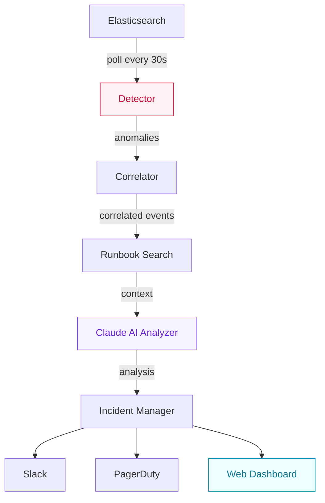

# SentinelOps

AI-powered incident response agent. Monitors Elasticsearch logs, detects anomalies using z-score analysis, correlates failures across services, and generates root cause analysis with remediation steps via Claude.

Built with Python, Elasticsearch, Claude API, and React.

---

## Architecture



**Detector** — Computes z-scores on error rates and p99 latency per service against a rolling baseline. Anomalies are classified P1–P4 based on configurable thresholds.

**Correlator** — Runs ES|QL queries to find related errors across services in the same time window. Surfaces cascading failures.

**Analyzer** — Sends full context to Claude API. Returns root cause, confidence level, and prioritized remediation steps.

**Incident Manager** — Deduplicates using hash-based keys with a cooldown window. Routes P1/P2 to PagerDuty, all severities to Slack.

---

## Severity Levels

| Level | Z-score | PagerDuty | Description |
|-------|---------|-----------|-------------|
| P1 | >= 5.0 | Yes | Critical — immediate action required |
| P2 | >= 3.5 | Yes | High — urgent attention needed |
| P3 | >= 2.5 | No | Medium — investigate soon |
| P4 | >= 2.0 | No | Low — monitor |

---

## Quick Start

### Prerequisites

- Docker & Docker Compose
- Anthropic API key

### Setup

```bash
cp .env.example .env
# Add your ANTHROPIC_API_KEY to .env

docker compose up --build
```

This starts Elasticsearch and SentinelOps on `localhost:8000`.

### Simulate an Incident

```bash
pip install elasticsearch
python scripts/simulate.py
```

Injects 60 minutes of baseline traffic followed by a 5-minute anomaly spike — payment-service connection pool exhaustion cascading to order-service and gateway.

SentinelOps detects it within 30 seconds.

---

## Dashboard

The web UI is served at `localhost:8000`. Built with React and Chakra UI.


---

## Project Structure

```
sentinelops/
├── main.py              # Async polling loop + API server
├── detector.py           # Z-score anomaly detection
├── correlator.py         # ES|QL cross-service correlation
├── analyzer.py           # Claude API integration
├── runbooks.py           # Historical runbook search
├── incidents.py          # Incident creation & dedup
├── store.py              # In-memory incident store
├── api.py                # FastAPI REST endpoints
├── config.py             # YAML + env config
├── models.py             # Pydantic models
└── integrations/
    ├── elasticsearch.py  # Async ES client
    ├── slack.py          # Block Kit notifications
    └── pagerduty.py      # PagerDuty events

web/                      # React + Chakra UI frontend
scripts/simulate.py       # Data injection script
tests/                    # Unit tests
```

---

## Configuration

Runtime config in `config.yaml`:

```yaml
polling:
  interval_seconds: 30
  lookback_minutes: 5

detection:
  thresholds:
    p1: 5.0
    p2: 3.5
    p3: 2.5
    p4: 2.0
  baseline_window_minutes: 60

correlation:
  window_minutes: 10
  max_events: 50

incidents:
  dedup_cooldown_minutes: 30
```

Secrets are loaded from `.env`:

```
ANTHROPIC_API_KEY=sk-ant-...
SLACK_BOT_TOKEN=xoxb-...          # optional
PAGERDUTY_API_KEY=...             # optional
```

---

## Stack

Python · Elasticsearch 8 · Claude API · FastAPI · React · Chakra UI · Docker
